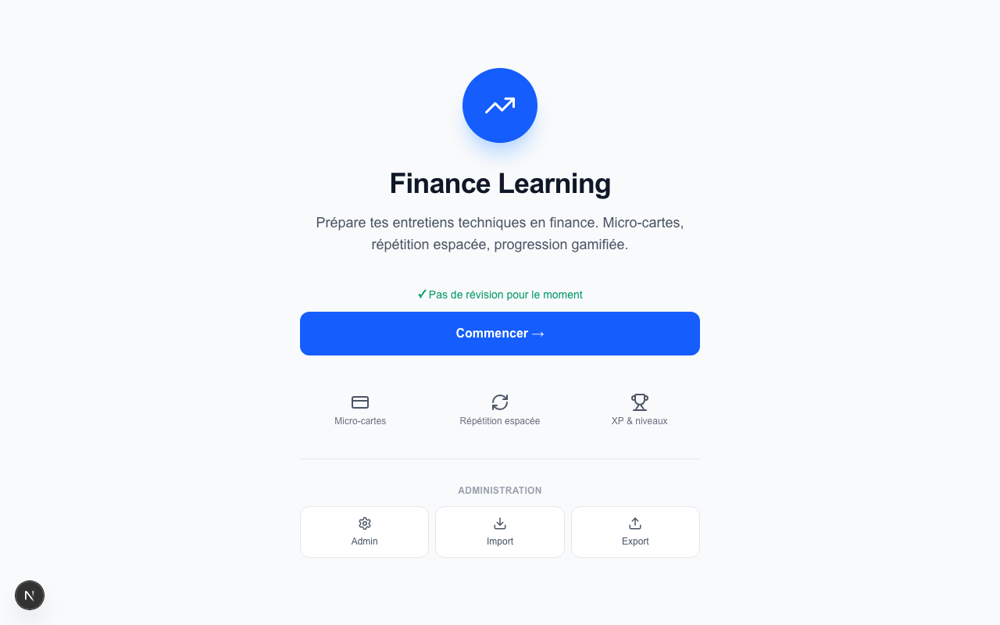
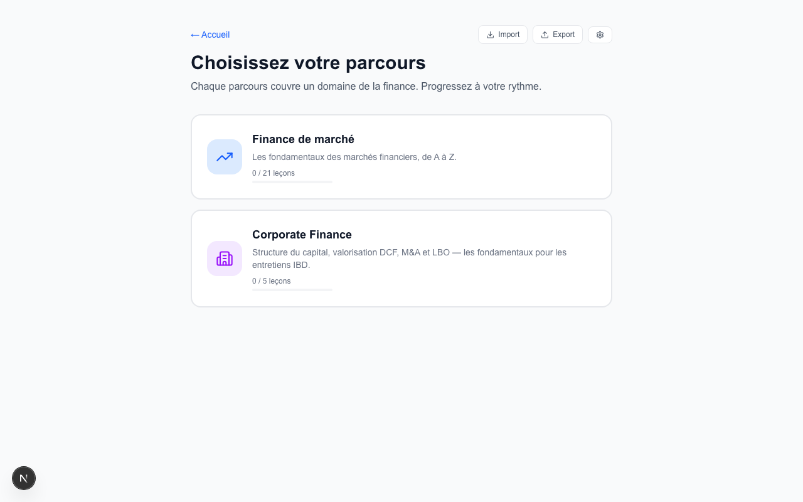
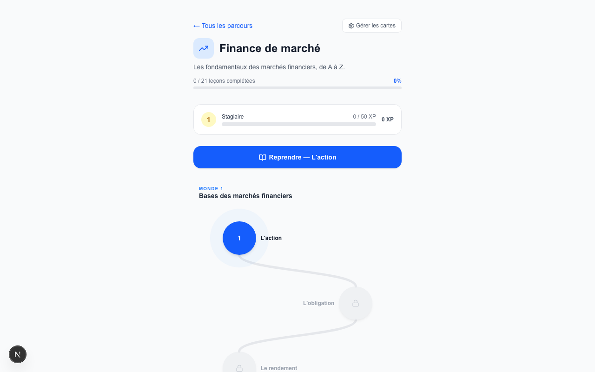
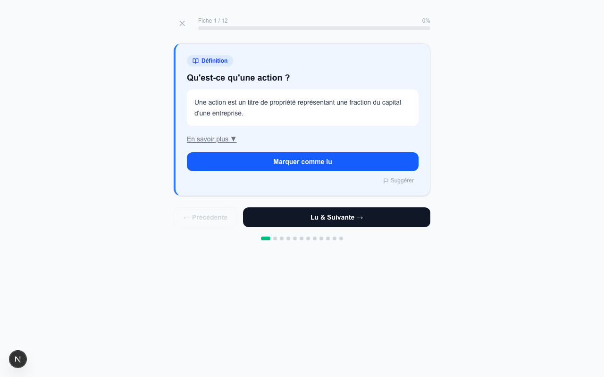
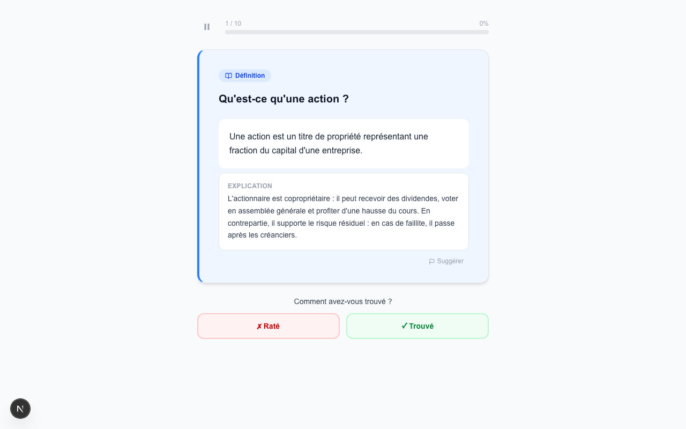
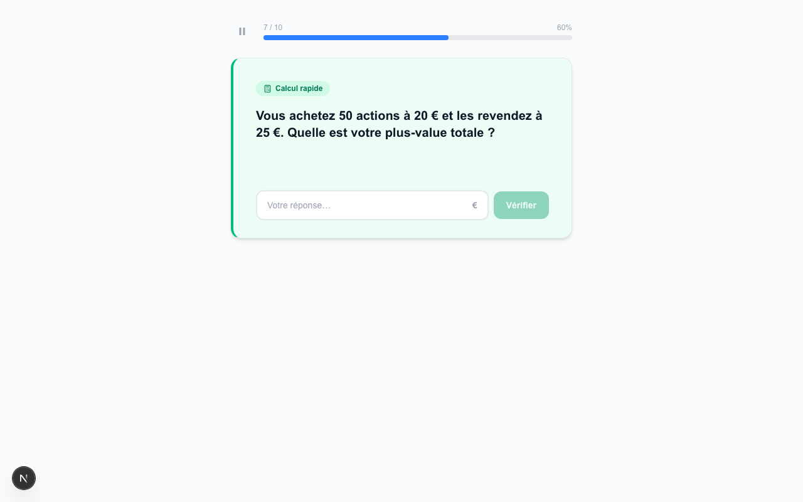
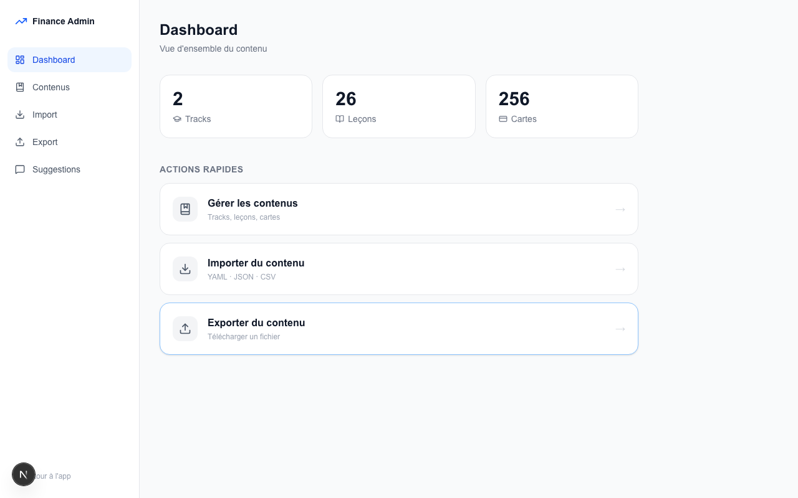
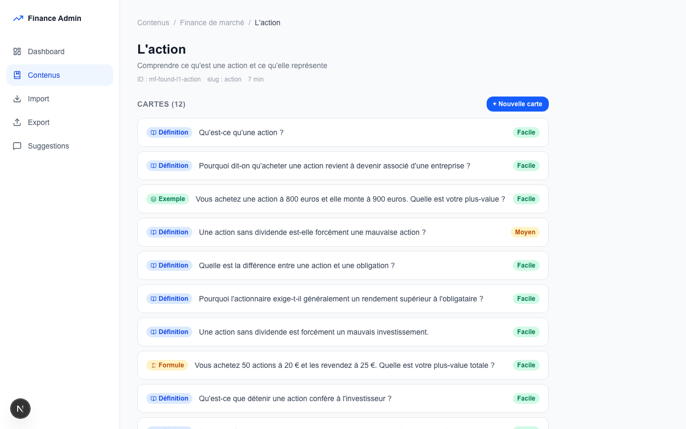
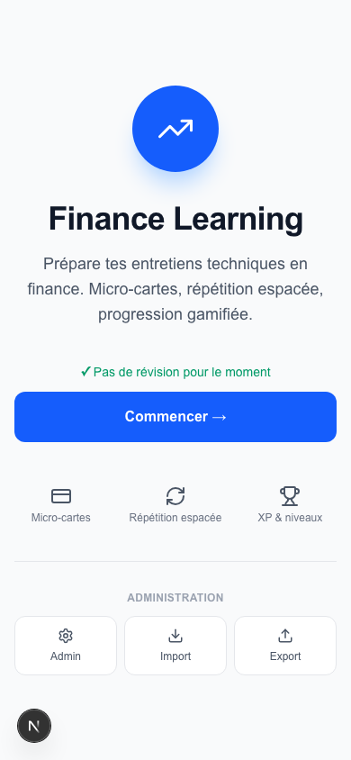

<div align="center">
  # 🎓 Finance App

  ### Master market & corporate finance concepts through gamified spaced-repetition.
  
  *Study flashcards, earn XP, track streaks, and climb the 9-level career ladder from Stagiaire to Partner.*

  <p>
    <a href="https://github.com/MaximeFARRE/finance-app/actions/workflows/ci.yml"></a>
    <a href="https://nextjs.org"></a>
    <a href="https://react.dev"></a>
    <a href="https://tailwindcss.com"></a>
    <a href="https://www.typescriptlang.org"></a>
    <a href="LICENSE"></a>
  </p>

  ---
</div>

## 📌 Table of Contents

- [🌟 Key Pillars & Features](#-key-pillars--features)
- [📸 Visual Tour](#-visual-tour)
- [📚 Course Content Directory](#-course-content-directory)
- [⚙️ Spaced Repetition (SM-2) & Gamification Mechanics](#️-spaced-repetition-sm-2--gamification-mechanics)
- [🛠️ Tech Stack & Architecture](#️-tech-stack-architecture)
- [🚀 Getting Started & CLI Commands](#-getting-started--cli-commands)
- [📂 Project Structure](#-project-structure)
- [📝 Content Management & Adding Lessons](#-content-management--adding-lessons)
- [🤝 Contributing & License](#-contributing--license)

---

## 🌟 Key Pillars & Features

- **🧠 Spaced Repetition (SM-2 Algorithm)** — Adapts dynamically to your learning pace. Harder cards reappear sooner, while easier cards are spaced out to maximize retention.
- **🎮 Gamified Career Ladder** — Complete sessions to gain XP, maintain a daily learning streak for score multipliers, and level up across 9 distinct finance career titles.
- **🔒 Difficulty Gating** — Encourages step-by-step learning. Higher difficulty levels (difficulty 2 and 3) unlock within a lesson only after mastering at least 70% of the cards in the previous difficulty.
- **🗂️ 5 Interactive Card Types** — Beyond text:
  - *Definition*: Simple front/back definition reveal with self-rating.
  - *Multiple Choice*: Select from 4 options with instant visual feedback.
  - *True / False*: Assess financial claims and learn from detailed explanations.
  - *Numeric Input*: Perform calculations with custom tolerance thresholds (e.g., float rounding).
  - *Learn Mode*: Read and absorb details before taking the quiz.
- **⚡ Daily Cross-Track Review** — Access a consolidated review queue directly from the home dashboard, combining all due cards from your unlocked lessons.
- **📁 Advanced Import / Export Engine** — Supports bulk updates of course data in YAML, JSON, or CSV formats. Includes a full diff visualizer previewing added, modified, or unchanged cards before importing.
- **🔧 Administrative Dashboard** — Complete CRUD control at `/admin`. Edit cards with live-preview rendering, browse version history, and manage user suggestions.
- **🔌 Offline-First & Sync-Ready** — All user progress, custom decks, and stats are preserved locally in the browser via `localStorage` and IndexedDB. Designed with an abstract interface prepared for a seamless Supabase sync integration.

---

## 📸 Visual Tour

### 🎯 Core User Journey

| Home Dashboard | Track Overview | Career Roadmap |
| :---: | :---: | :---: |
|  |  |  |
| *Consolidated daily review and career stats* | *List of financial tracks and completion meters* | *Lesson grid with locks, stars, and XP progress* |

### 📖 Interactive Learning & Card Formats

| Flashcard Flip | Multiple Choice (MCQ) | Numeric Calculation |
| :---: | :---: | :---: |
|  |  |  |
| *Toggle definitions and self-evaluate* | *Select answers with interactive feedback* | *Validate calculations within tolerance* |

### ⚙️ Admin Dashboard & Mobile View

| Admin Panel & Version History | Dynamic Card Builder | Mobile Optimization |
| :---: | :---: | :---: |
|  |  |  |
| *Manage files, view edits & review suggestions* | *Card editor with real-time markdown preview* | *Fully responsive layout built for study-on-the-go* |

---

## 📚 Course Content Directory

Our core curriculum is structured around two distinct tracks, divided into thematic worlds and interactive lessons:

| Track | Theme Worlds | Total Lessons | Approx. Cards |
| :--- | :---: | :---: | :---: |
| **Finance de Marché** (Market Finance) | 2 | 21 | ~216 |
| **Corporate Finance** (Investment Banking) | — | 5 | ~40 |
| **Total Curriculum** | **2** | **26** | **~256** |

### 📈 Finance de marché — World 1 : Fondamentaux
Focuses on basic market structures: equities, bonds, yield calculations, market cap, primary & secondary markets, liquidity, trading volumes, market participants (buy-side vs. sell-side), and dividends. The world concludes with an integrated **Boss Quiz** covering all fundamentals.

### 📊 Finance de marché — World 2 : Instruments & Analyse
Introduces index construction (CAC 40, MSCI World, free-float weighting), ETFs, yield curves, fundamental valuation ratios (P/E, EV/EBITDA, DCF), derivative options, futures, hedging, and foreign exchange (EUR/USD, carry trade, PPP). Ends with a comprehensive **World 2 Boss Quiz**.

### 💼 Corporate Finance
Covers capital structure, discounted cash flows (DCF), comparable company analysis, M&A dynamics, and leveraged buyouts (LBO).

---

## ⚙️ Spaced Repetition (SM-2) & Gamification Mechanics

### 🧠 The SM-2 Algorithm

Every flashcard holds a progress record containing repetitions, ease factor, interval, and next review date.

- When rating a card, the user provides a score mapped to a quality value from `0` (Forgot/Wrong) to `5` (Perfect).
- **If Quality < 3**: The review streak is broken. The repetition count is reset, and the review interval is reset to `1 day`.
- **If Quality ≥ 3**: The card is scheduled for a future review:
  - For the 1st repetition: `interval = 1 day`.
  - For the 2nd repetition: `interval = 6 days`.
  - For repetitions $> 2$: `interval = interval × easeFactor`.
- **Ease Factor Update**: The ease factor adjusts dynamically:
  $$\text{easeFactor}_{\text{new}} = \max(1.3, \text{easeFactor}_{\text{old}} + (0.1 - (5 - \text{quality}) \times 0.08))$$

### 🔒 Difficulty Gating Thresholds

To prevent information overload and build clean mental models:
1. **Difficulty 1 (Beginner)**: Cards are immediately accessible in any unlocked lesson.
2. **Difficulty 2 (Intermediate)**: Unlocks only when $\ge 70\%$ of the lesson's Difficulty 1 cards have been successfully memorized ($\ge 1$ repetition).
3. **Difficulty 3 (Advanced)**: Unlocks when $\ge 70\%$ of the combined Difficulty 1 & 2 cards are mastered.

### 🏆 Career Titles & XP Milestones

Gain XP with every answer. Maintaining a daily streak of $\ge 3$ active days awards a **1.5x multiplier** (rounded up) on XP gains.

| Career Level | Professional Title | Cumulative XP Required |
| :---: | :--- | :---: |
| **1** | Stagiaire (Intern) | 0 XP |
| **2** | Analyste Junior | 50 XP |
| **3** | Analyste | 150 XP |
| **4** | Analyste Senior | 350 XP |
| **5** | Associate | 700 XP |
| **6** | VP (Vice President) | 1,200 XP |
| **7** | Director | 2,000 XP |
| **8** | Managing Director | 3,500 XP |
| **9** | Partner | 6,000 XP |

---

## 🛠️ Tech Stack & Architecture

The application is structured as a client-side platform with a clean separation of concerns.

- **Frontend Shell**: Next.js 16 (App Router) combined with React 19 for reactive rendering and client-side page shells.
- **Styling**: Tailwind CSS v4.0 for utility-first responsive layouts.
- **Language**: TypeScript 5 (strict type-safety).
- **Database & Local Persistence**:
  - `localStorage`: Preserves lightweight user stats (XP, streak history, levels, completed lessons) in `finance-app:progress`.
  - `IndexedDB`: Handles larger content tables, dynamic cards, user suggestions, and historical edits in `finance-app-content`.
- **Unit Testing**: Vitest & JSDOM running sub-millisecond local test suites.

### 🔄 Architecture Diagram

```
                       ┌────────────────────────────────────────────────────────┐
                       │                   Client Browser                       │
                       │                                                        │
                       │  ┌──────────────────┐     ┌────────────────────────┐   │
                       │  │   Next.js App    │     │       src/lib/         │   │
                       │  │   App Router     │────▶│  Core Business Logic   │   │
                       │  │   (src/app/)     │     │  (SM-2, Progress, etc) │   │
                       │  └────────┬─────────┘     └───────────┬────────────┘   │
                       │           │                           │                │
                       │  ┌────────▼─────────┐     ┌───────────▼────────────┐   │
                       │  │ React Components │     │    ContentProvider     │   │
                       │  │ (src/components) │     │ (Abstract Data Layer)  │   │
                       │  └──────────────────┘     └───────────┬────────────┘   │
                       │                                       │                │
                       │  ┌──────────────────┐     ┌───────────▼────────────┐   │
                       │  │   src/content/   │     │  IndexedDB Database    │   │
                       │  │   Static Data    │     │  (Admin/Import Custom) │   │
                       │  └──────────────────┘     └────────────────────────┘   │
                       └────────────────────────────────────────────────────────┘
```

---

## 🚀 Getting Started & CLI Commands

### Prerequisites
- **Node.js** v20 or higher.
- **npm** (comes packaged with Node.js).

### Installation & Run

1. Clone the repository and navigate to the directory:
   ```bash
   git clone https://github.com/MaximeFARRE/finance-app.git
   cd finance-app
   ```
2. Install dependencies:
   ```bash
   npm install
   ```
3. Boot the development server:
   ```bash
   npm run dev
   ```
4. Open your browser and go to [http://localhost:3000](http://localhost:3000).

*(For Windows users, you can run the pre-configured [lancer.bat](file:///Users/macbook/Documents/Projet%20perso/finance-app/lancer.bat) script which starts the server on port `3210` and automatically opens your default browser).*

### Available Script Directory

| CLI Command | Task Description |
| :--- | :--- |
| `npm run dev` | Spins up the Next.js development server on port `3000` |
| `npm run build` | Compiles the production-ready static assets |
| `npm start` | Launches the compiled Next.js production build |
| `npm run typecheck`| Invokes TypeScript compiler in `--noEmit` mode to validate types |
| `npm run lint` | Inspects the codebase using ESLint 9 |
| `npm test` | Launches the Vitest test runner for a single verification sweep |
| `npm run test:watch` | Runs Vitest in interactive watch mode for active testing |

---

## 📂 Project Structure

Below is an overview of the key directories and modules:

```
src/
├── app/                    # Next.js pages and routing endpoints
│   ├── page.tsx            # Home page with review triggers and user stats
│   ├── tracks/             # Track directory and visual maps
│   ├── session/            # Spaced repetition study flows (quiz & review modes)
│   ├── results/            # Post-session performance breakdown
│   └── admin/              # Dashboard, YAML imports, suggestions & card editor
├── components/             # Reusable UI component modules
│   ├── LearningCard.tsx    # Interactive flashcards (flip, MCQs, True/False, calculations)
│   ├── LearnCard.tsx       # Content display card with section foldouts
│   ├── LessonList.tsx      # Render grid for courses with lock & unlock logic
│   ├── XPBar.tsx           # XP meters, current levels, and rank cards
│   └── admin/              # Admin forms, histories, diff visualizers
├── content/                # Course databases divided into static lesson files
│   ├── index.ts            # Core track registry and active content version
│   ├── market-finance/     # 21 market finance lessons (equity, forex, options...)
│   └── corporate-finance/  # 5 corporate finance lessons (DCF, M&A, capital...)
└── lib/                    # Business rules and utility scripts
    ├── types.ts            # Shared types and data interfaces
    ├── spaced-repetition.ts# Implementation of the SM-2 algorithm
    ├── progression.ts      # XP computations, streak trackers, star ratings
    ├── level-engine.ts     # Level thresholds mapping XP to career rankings
    ├── difficulty-gate.ts  # Filter matrices preventing access to intermediate cards
    ├── local-content-provider.ts # Local database drivers mapping details onto IndexedDB
    └── import-export/      # File translation pipeline (CSV, YAML, JSON parsers)
```

---

## 📝 Content Management & Adding Lessons

Refer to the complete style guidelines in [AGENTS.md](file:///Users/macbook/Documents/Projet%20perso/finance-app/AGENTS.md) when contributing content.

### Adding cards to migrated lessons:
Migrated market finance lessons must follow the strict JSON-style schema in their dedicated `.ts` file. Do not use legacy card formats or forbidden type values like `intuition`, `trap`, or `interview-question`.
```typescript
{
  id: "mf-found-l1-action-def-3a7f", // Track - World - Lesson - Type - Hex
  type: "definition",                // Approved: definition, formula, example
  questionType: "definition",        // Approved: definition, comparison, mechanism, formula, quick-calculation, market-culture, true-false
  question: "Question affichée recto ?",
  shortAnswer: "Réponse concise en 1-2 phrases.",
  explanation: "Explication supplémentaire optionnelle.",
  front: "Question affichée recto ?",  // Duplicate of question
  back: "Réponse concise en 1-2 phrases.",   // Duplicate of shortAnswer
  difficulty: 1,                     // 1 | 2 | 3
  learningStage: 1,                  // Always 1 for new cards
  topics: ["action", "equity"],      // Max 4 tags, kebab-case
  skills: ["definition"],            // One or more approved skills
  tags: ["action", "equity"],        // Max 4 tags, kebab-case
}
```

### Steps to create a new lesson:
1. **Create the file**: Place the lesson data in `src/content/market-finance/lX-concept-name.ts` conforming to the `Lesson` interface.
2. **Register the lesson**: Import and add your lesson to the respective track's registry in `src/content/market-finance/index.ts` (or `corporate-finance`).
3. **Bump the Content Version**: Increment the `BUILTIN_CONTENT_VERSION` in [src/content/index.ts](file:///Users/macbook/Documents/Projet%20perso/finance-app/src/content/index.ts) to force a refresh on users' devices.
4. **Test**: Run typechecking and tests:
   ```bash
   npx tsc --noEmit
   npx vitest run
   ```

---

## 🤝 Contributing & License

For development guidelines, branching conventions, and contribution workflows, please check the [CONTRIBUTING.md](file:///Users/macbook/Documents/Projet%20perso/finance-app/CONTRIBUTING.md) guide.

Distributed under the MIT License. See [LICENSE](file:///Users/macbook/Documents/Projet%20perso/finance-app/LICENSE) for more information.

---
<div align="center">
  <sub>Developed with ❤️ by <a href="https://github.com/MaximeFARRE">Maxime FARRE</a>. Built in 2025.</sub>
</div>
