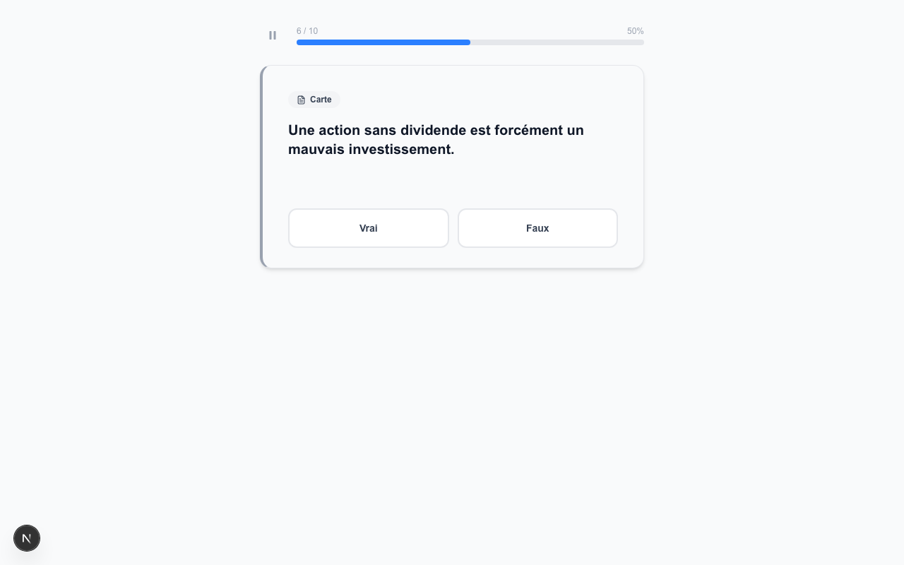

# Finance App

[](https://github.com/MaximeFARRE/finance-app/actions/workflows/ci.yml)
[](LICENSE)
[](https://nextjs.org)
[](https://www.typescriptlang.org)

A gamified, offline-first spaced-repetition app to master finance interview concepts. Study flashcards, earn XP, and track your progress through a 9-level career system — from *Stagiaire* to *Partner*.

---

## Screenshots

### Home & Navigation

| Home | Track list | Track map |
|------|-----------|-----------|
|  |  |  |

### Learning & Quiz

| Learn — flashcard | Quiz — reveal answer | Quiz — Multiple Choice |
|-------------------|---------------------|------------------------|
|  |  |  |

| Quiz — True / False | Quiz — Numeric input |
|---------------------|----------------------|
|  |  |

### Admin & Mobile

| Admin dashboard | Admin — lesson view | Mobile — home |
|-----------------|---------------------|---------------|
|  |  |  |

---

## Features

- **Spaced Repetition (SM-2)** — cards adapt to your performance; weak cards come back sooner
- **5 Interactive Card Types** — Flip (reveal answer), Multiple Choice (4 options), True/False, Numeric Input, and classic Flashcard
- **XP & Level System** — 9 finance career levels (Stagiaire → Partner) with XP rewards and streak bonuses
- **Lesson Stars** — earn 1–3 stars per lesson based on accuracy
- **World-based Progression** — lessons grouped into thematic worlds with a Boss challenge at the end of each
- **Difficulty Gating** — difficulty-2 cards unlock only once ≥ 70% of difficulty-1 cards are mastered
- **Cross-lesson Review Mode** — daily review queue built from all due cards across every track
- **Suggestion System** — flag errors or propose new cards directly from the flashcard UI
- **Admin UI** — full content management at `/admin`: browse tracks/lessons/cards, CRUD editor with live preview and version history, import/export, and suggestions management
- **Import / Export** — bulk content management via YAML (primary), JSON, or CSV; diff preview before applying changes
- **Offline-First** — all progress stored locally in the browser; no account required

---

## Content

| Track | Worlds | Lessons | Cards |
|-------|--------|---------|-------|
| Finance de marché | 2 | 21 | ~216 |
| Corporate Finance | — | 5 | ~40 |
| **Total** | | **26** | **~256** |

### Finance de marché — World 1 : Fondamentaux

Covers the essential building blocks of markets: equity (actions), bonds (obligations), returns, risk, market cap, primary & secondary markets, liquidity, volume, market participants (acteurs, buy-side / sell-side), and dividends. Ends with a Boss quiz covering all World-1 topics.

### Finance de marché — World 2 : Instruments & Analyse

Extends into index construction (CAC 40, MSCI World, free-float weighting), ETFs & passive management, yield curves & rate spreads, fundamental valuation (P/E, EV/EBITDA, DCF), options (calls, puts, Greeks primer), futures & hedging, and forex (EUR/USD, carry trade, PPP). Ends with a Boss quiz covering all World-2 topics.

---

## Tech Stack

| Layer | Technology |
|-------|-----------|
| Framework | Next.js 16 (App Router) |
| UI | React 19 + Tailwind CSS v4 |
| Language | TypeScript 5 (strict) |
| Storage | localStorage (offline-first) |
| Testing | Vitest + jsdom |
| Linting | ESLint 9 + Prettier |

---

## Getting Started

**Requirements:** Node.js 20+

```bash
git clone https://github.com/MaximeFARRE/finance-app.git
cd finance-app
npm install
npm run dev
```

Open [http://localhost:3000](http://localhost:3000) in your browser.

On Windows you can also run `lancer.bat` — it starts the dev server on port 3210 and opens the browser automatically.

### Available Scripts

| Command | Description |
|---------|-------------|
| `npm run dev` | Start the development server |
| `npm run build` | Build for production |
| `npm start` | Run the production build |
| `npm run typecheck` | TypeScript type checking |
| `npm run lint` | Run ESLint |
| `npm test` | Run unit tests (single run) |
| `npm run test:watch` | Run tests in watch mode |

---

## Project Structure

```
src/
├── app/                    # Next.js App Router pages
│   ├── page.tsx            # Home / landing (with daily review badge)
│   ├── tracks/             # Track listing & detail pages
│   ├── session/            # Active learning & quiz session
│   ├── results/            # Session results screen
│   └── admin/              # Content management UI
│       ├── page.tsx        # Admin dashboard
│       ├── tracks/         # Track / lesson / card browser & editor
│       ├── import/         # Bulk import with diff preview
│       ├── export/         # Bulk export (YAML / JSON / CSV)
│       └── suggestions/    # User suggestion review queue
├── components/             # Reusable UI components
│   ├── LearningCard.tsx    # Flip card (reveal answer + SM-2 self-rating)
│   ├── MCQCard.tsx         # Multiple-choice card (A / B / C / D)
│   ├── TrueFalseCard.tsx   # True / False card
│   ├── NumericCard.tsx     # Numeric input card
│   ├── LearnCard.tsx       # Learn-mode card (full detail reveal)
│   ├── LessonList.tsx      # Lesson grid with lock / star states
│   ├── XPBar.tsx           # XP progress bar and level display
│   └── admin/              # Admin-only components
│       ├── CardForm.tsx    # Card editor with live validation
│       ├── CardPreview.tsx # Real-time card preview
│       ├── CardHistory.tsx # Version history with restore
│       └── ImportDiff.tsx  # Import diff visualizer
├── content/                # Course data — one file per lesson
│   ├── index.ts            # Track registry, lookup helpers, content version
│   ├── market-finance/
│   │   ├── index.ts        # Track definition with world structure
│   │   ├── l1-action.ts    # World 1 — L'action
│   │   ├── l1-obligation.ts
│   │   ├── ...             # (13 World-1 lessons + boss-world-1)
│   │   ├── l2-indices.ts   # World 2 — Indices boursiers
│   │   ├── l2-etf.ts
│   │   ├── l2-courbe-des-taux.ts
│   │   ├── l2-analyse-fondamentale.ts
│   │   ├── l2-options.ts
│   │   ├── l2-futures.ts
│   │   ├── l2-change.ts
│   │   └── boss-world-2.ts # World 2 Boss quiz (12 mixed questions)
│   └── corporate-finance/
│       ├── index.ts
│       ├── l1-structure-du-capital.ts
│       ├── l2-valorisation-dcf.ts
│       ├── l3-comparables.ts
│       ├── l4-fusions-acquisitions.ts
│       └── l5-lbo.ts
└── lib/                    # Core business logic
    ├── types.ts            # Shared TypeScript types
    ├── spaced-repetition.ts  # SM-2 algorithm
    ├── progression.ts      # XP gain & streak logic
    ├── level-engine.ts     # 9-level ranking system
    ├── unlock.ts           # Lesson unlock rules
    ├── difficulty-gate.ts  # Difficulty unlock (70% mastery threshold)
    ├── quiz-utils.ts       # Quiz deck builder (due-first + difficulty gating)
    ├── lesson-deck.ts      # Per-lesson deck builder (limit = 10)
    ├── review-utils.ts     # Cross-lesson review deck builder
    ├── storage.ts          # localStorage persistence
    └── import-export/      # YAML / JSON / CSV import-export engine
```

---

## Adding Content

See [`AGENTS.md`](AGENTS.md) for the complete card format reference.

**Quick rules:**
- One TypeScript file per lesson (`src/content/<track>/<lessonId>.ts`)
- Card IDs are permanent — changing one loses SM-2 progress for all users
- Bump `BUILTIN_CONTENT_VERSION` in `src/content/index.ts` whenever cards are added or removed
- Run `npx tsc --noEmit && npx vitest run` after every change

**Card types available:**

| Type | UI | Fields |
|------|----|--------|
| Flip (definition) | Reveal-answer with self-rating | `front`, `back`, `explanation` |
| Multiple Choice | A / B / C / D radio buttons | `choices[]`, `correctIndex` |
| True / False | Vrai / Faux buttons | `correctBool` |
| Numeric input | Number entry + tolerance check | `expectedAnswer`, `answerUnit`, `tolerance` |

---

## Architecture

See [`docs/ARCHITECTURE.md`](docs/ARCHITECTURE.md) for a detailed overview of the system design, data flow, and algorithms.

---

## Contributing

Contributions are welcome! Please read [`CONTRIBUTING.md`](CONTRIBUTING.md) before opening a pull request.

---

## License

[MIT](LICENSE) © 2025 Maxime FARRE
